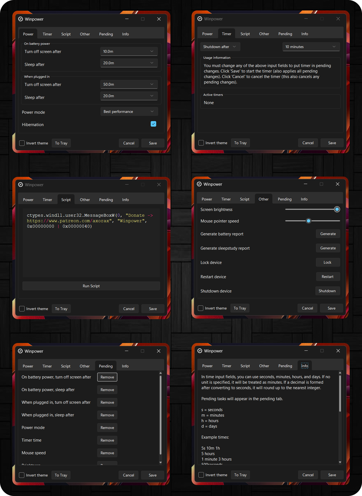

    

<h3 align="center">Winpower</h3>

Improved power settings for Windows

## 💻 Preview

    

## ✨ Features

- Add custom sleep and screen shutdown times.
- Write custom scripts.
- Execute scripts, shutdown, restart and lock commands after specified time.
- Generate reports.
- Manage changed settings to cancel or apply them.

---

<a href="https://www.patreon.com/axorax">Support me on Patreon</a> — <a href="https://github.com/axorax/socials">Check out my socials</a>

